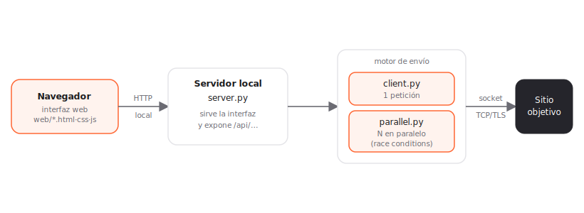
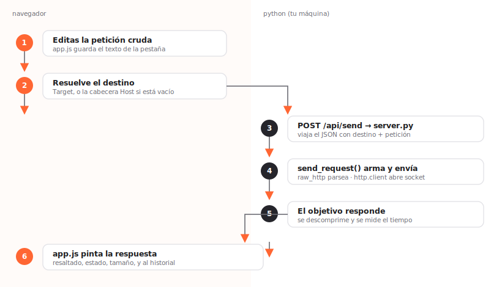
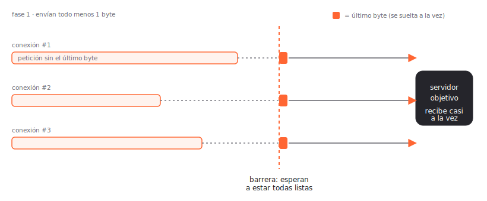
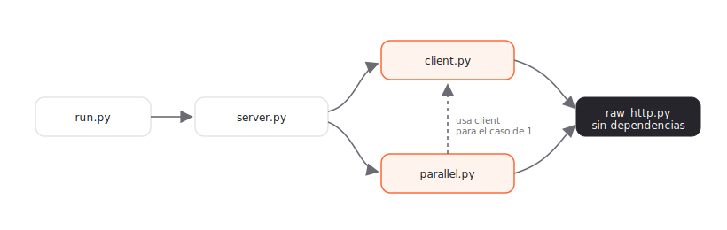

# Cómo funciona Repeater Clone (y cómo construir el tuyo)

Esta guía no es una lista de funciones: es el **razonamiento**. Explica los flujos de principio a fin, por qué cada pieza está donde está, y qué necesitarías para construir tu propio repeater partiendo de este. Si al terminar entiendes *por qué* el navegador no envía la petición o *por qué* se retiene el último byte, has ganado.

---
## 1. El problema que resuelve un repeater

Un *repeater* sirve para **editar una petición HTTP a mano y reenviarla las veces que quieras**, observando la respuesta cruda. Es la herramienta básica de cualquier prueba web: cambias una cabecera, un parámetro o el método, y ves exactamente qué contesta el servidor, sin que nada "arregle" tu petición por el camino.

La palabra clave es *cruda*. Quieres controlar cada byte: el orden de las cabeceras, mayúsculas raras, un `Content-Length` mentiroso, un `Host` que no coincide con el destino real. Justo eso es lo que ninguna herramienta "amable" te deja hacer.

---
## 2. La decisión central: por qué hay dos mundos

Aquí está el porqué de toda la arquitectura. Si intentaras enviar la petición **desde el propio navegador** (con `fetch` o `XMLHttpRequest`), chocarías con dos muros:

- **CORS y cabeceras prohibidas.** El navegador no te deja fijar `Host`, `Connection`, `Content-Length` y otras cabeceras "de control". Las gestiona él. Adiós al control byte a byte.
- **No ves la respuesta cruda.** Ante un dominio distinto, CORS te oculta cabeceras y cuerpo. No puedes inspeccionar lo que de verdad llegó.

La solución es mover el envío a un **backend propio**. El navegador solo dibuja la interfaz; cuando pulsas *Send*, manda tu petición a un pequeño servidor local en Python, y **ese** servidor abre el socket hacia el objetivo. Python no tiene CORS ni reescribe tus cabeceras: envía lo que le digas.



Regla mental para todo lo que sigue: **el navegador nunca habla con el objetivo**. Habla con tu servidor local (`http://127.0.0.1:8777`), y este reenvía. Las cuatro cajas del diagrama —navegador, servidor, motor de envío, objetivo— son la columna vertebral del proyecto.

---
## 3. El corazón: una petición HTTP es solo texto

Antes de enviar nada hay que entender qué es una petición HTTP. Es texto plano con una forma muy simple:

```
GET /ruta?x=1 HTTP/1.1      ← línea de petición: MÉTODO RUTA VERSIÓN
Host: example.com           ← cabeceras: "clave: valor", una por línea
User-Agent: lo-que-sea
                            ← una LÍNEA EN BLANCO separa cabeceras y cuerpo
cuerpo opcional aquí
```

Todo el trabajo de "parsear" consiste en partir ese texto por sus juntas. La función que lo hace (`parse_raw_request` en `raw_http.py`) es el núcleo conceptual del proyecto:

```python
def parse_raw_request(raw):
    raw = raw.replace("\r\n", "\n").replace("\r", "\n")  # normalizar saltos
    head, _, body = raw.partition("\n\n")                # 1ª línea en blanco = frontera
    lines = head.split("\n")
    method, path = (lines[0].split() + ["GET", "/"])[:2] # de la 1ª línea
    headers = []
    for line in lines[1:]:
        if ":" in line:
            k, v = line.split(":", 1)                     # split(":", 1): la 1ª ":" manda
            headers.append((k.strip(), v.strip()))
    return method, path, headers, body
```

Tres detalles que parecen menores y no lo son:

- **Normalizar `\r\n` a `\n`** primero. Así el resto del código no se preocupa por el tipo de salto de línea; al reconstruir para la red, se vuelve a poner `\r\n` (que es lo que exige HTTP).
- **Separar por la primera línea en blanco.** Ese `\n\n` es la frontera oficial entre cabeceras y cuerpo. Sin ella, no sabrías dónde empieza el cuerpo de un POST.
- **`split(":", 1)`** al partir cada cabecera: solo la primera coma divide. Si no, una cabecera como `Date: Mon, 01 Jan` se rompería mal.

Con esto ya tienes la petición en piezas manipulables. El resto del programa gira alrededor de estas cuatro: método, ruta, cabeceras, cuerpo.

---
## 4. El flujo de enviar una petición, paso a paso

Este es el recorrido completo desde que pulsas *Send* hasta que ves la respuesta. La mitad izquierda ocurre en el navegador; a partir del paso 3, todo es Python.



1. **Editas** la petición cruda. `app.js` guarda ese texto en la pestaña activa.
2. **Se resuelve el destino.** ¿A qué IP y puerto conecto, y con TLS o sin él? Sale del campo *Target*, o de la cabecera `Host` si lo dejas vacío (más sobre esto en §7).
3. **`POST /api/send`.** El navegador manda un JSON con el destino y la petición al servidor local. Aquí cruza del mundo JS al mundo Python.
4. **`send_request()` arma y envía.** Parsea, recalcula `Content-Length` si hace falta, abre el socket y escribe la petición.
5. **El objetivo responde.** Se lee, se descomprime y se mide el tiempo.
6. **`app.js` pinta** la respuesta con resaltado y la guarda en el historial.

El paso 4 tiene una sutileza que define la herramienta. Al enviar con `http.client`, se usan dos banderas:

```python
conn.putrequest(method, path, skip_host=True, skip_accept_encoding=True)
for k, v in headers:
    conn.putheader(k, v)
conn.endheaders(body or None)
```

`skip_host=True` y `skip_accept_encoding=True` le dicen a la librería: **no añadas cabeceras por tu cuenta**. Por defecto, `http.client` insertaría un `Host` y un `Accept-Encoding` automáticos. En un repeater eso es veneno: quieres que el servidor reciba *exactamente* las cabeceras que escribiste, ni una más. Estas dos banderas son la diferencia entre "una herramienta que envía lo que tú dices" y "una que envía lo que ella cree que deberías decir".

El otro detalle es el **`Content-Length`**. Si editas el cuerpo de un POST, su longitud cambia. La opción "Actualizar Content-Length" recalcula esa cabecera por ti (quitando la vieja y poniendo la nueva) para que el servidor no se quede esperando bytes que no llegan o corte de más. Puedes desactivarlo cuando quieras mentir a propósito sobre la longitud —una prueba clásica—.

---
## 5. Entender la respuesta: compresión y *chunked*

Recibir la respuesta no es solo leer bytes. Los servidores modernos casi siempre te la mandan **comprimida** y a menudo **troceada**, así que si te limitas a `resp.read()` verás basura binaria. Hay que deshacer dos capas.

**Compresión (`Content-Encoding`).** El servidor comprime el cuerpo con gzip, deflate o brotli. Se detecta por la cabecera y se descomprime:

```python
if "gzip" in enc:    return gzip.decompress(data)
if "deflate" in enc: return zlib.decompress(data)      # con fallback a raw deflate
if "br" in enc:      return brotli.decompress(data)     # brotli es opcional
```

La idea es: mira `Content-Encoding`, aplica el descompresor correspondiente, y si algo falla devuelve los bytes tal cual (mejor mostrar algo raro que reventar).

**Troceado (`Transfer-Encoding: chunked`).** Cuando el servidor no sabe de antemano cuánto va a medir la respuesta, la manda en trozos, cada uno precedido por su tamaño en hexadecimal, y termina con un trozo de tamaño `0`. Reensamblarlo es leer tamaño → leer esos bytes → repetir hasta el `0`:

```python
size = int(data[i:j].split(b";")[0].strip(), 16)  # tamaño en hex
if size == 0:
    break                                          # trozo 0 = fin
out += data[start:start + size]
```

El **orden importa**: primero se junta el *chunked* (para tener el cuerpo entero) y luego se descomprime. Al revés no funcionaría, porque descomprimirías trozos sueltos.

---
## 6. La joya: race conditions con sincronización por último byte

Esta es la parte que distingue un repeater de juguete de uno serio, y merece entenderse bien.

**El problema.** Para provocar una *race condition* necesitas que varias peticiones lleguen al servidor **en el mismo instante** (por ejemplo, canjear un cupón dos veces antes de que la primera se registre). Pero aunque las lances "a la vez" con hilos, la red introduce microrretardos: unas llegan antes que otras y no hay carrera.

**La idea.** Envía de cada petición **todo menos su último byte**. Sin ese byte, el servidor tiene la petición casi entera pero no puede darla por terminada ni procesarla: se queda esperando. Cuando *todas* las conexiones están en ese punto, sueltas el último byte de todas a la vez. El servidor recibe el cierre de todas casi simultáneamente. Los microrretardos de la red ya ocurrieron *antes*, al mandar el grueso; el instante crítico queda limpio.



En código, la coreografía la dirige una `threading.Barrier`. Una barrera para N hilos hace que cada `barrier.wait()` se bloquee hasta que los N han llegado; entonces se liberan todos de golpe. El hilo de cada conexión hace esto:

```python
data = build_request_bytes(...)       # la petición completa en bytes
sock = open_socket(...)               # abre socket + handshake TLS AQUÍ
sock.sendall(data[:-1])               # 1) envía TODO menos el último byte
barrier.wait()                        # 2) espera a que todos lleguen aquí
sock.sendall(data[-1:])               # 3) suelta el último byte (a la vez)
```

Dos decisiones finas:

- **El socket se abre y el TLS se negocia *antes* de la barrera.** El handshake TLS es lento y variable; si lo hicieras después, arruinaría la sincronización. Cuando se abre la compuerta, lo único que queda por hacer es mandar 1 byte, que es instantáneo.
- **Al final se ordenan las respuestas por su tiempo de llegada** y se les asigna un puesto (`order`). Esa columna es la que te dice quién "ganó" la carrera, que es justo lo que quieres analizar.

Si una conexión falla al prepararse, se llama a `barrier.abort()` para que las demás no se queden colgadas esperando eternamente a un hilo que ya no va a llegar.

---
## 7. Un detalle de diseño con enjundia: Target ≠ Host

Parece redundante tener un campo *Target* y además una cabecera `Host` en la petición, pero **son cosas distintas a propósito**, y entender la diferencia enseña mucho de HTTP:

- El **Target** decide la conexión física: a qué IP/puerto abres el socket y si usas TLS.
- La cabecera **Host** es solo un dato dentro de la petición; le dice al servidor qué sitio virtual quieres.

Normalmente coinciden, pero separarlos permite pruebas potentes: apuntar la conexión a una IP concreta mientras mandas otro `Host` (para *Host header injection*, enrutado de virtual hosts, etc.). Como el esquema (http/https) tampoco se puede deducir solo del `Host`, hace falta el Target para el caso avanzado.

Para no molestar en el uso normal, el Target es **opcional**: si lo dejas vacío, se deriva de la cabecera `Host` (https por defecto, http si el puerto es 80). Si lo rellenas, manda el Target. Esa lógica vive en `resolveTarget()` en `app.js`.

---
## 8. El pegamento: servidor local y la API

El servidor (`server.py`) cumple dos papeles a la vez con un solo `ThreadingHTTPServer`:

- **Sirve la interfaz**: ante `GET /` entrega `web/index.html`, y `web/style.css` / `web/app.js` como estáticos (con una comprobación para no servir archivos fuera de la carpeta `web/`).
- **Expone la API**: `POST /api/send` llama a `send_request` (una petición) y `POST /api/send_group` a `send_group_parallel` (el grupo en paralelo). Entra JSON, sale JSON.

¿Por qué **Threading**HTTPServer y no el servidor simple? Porque el envío en paralelo lanza varios hilos que hacen peticiones a la vez; el servidor tiene que poder atender concurrencia sin bloquearse. Es una de esas decisiones que no se notan hasta que, sin ellas, todo se serializa y la sincronización deja de tener sentido.

El navegador, por su parte, solo hace esto: arma el JSON, lo manda con `fetch`, y pinta la respuesta. Toda la "inteligencia de red" está en Python; `app.js` es presentación (pestañas, resaltado, historial, Inspector, notas).

---
## 9. Construye el tuyo

Aquí está lo práctico. Un repeater se puede empezar en **~50 líneas** y crecer por capas. El archivo `ejemplo_minimo.py` es exactamente ese punto de partida, y funciona:

```python
def send(scheme, host, port, raw):
    method, path, headers, body = parse_raw(raw)     # (1) parsear
    conn = (http.client.HTTPSConnection if scheme=="https"
            else http.client.HTTPConnection)(host, port, timeout=30)
    conn.putrequest(method, path, skip_host=True, skip_accept_encoding=True)
    for k, v in headers: conn.putheader(k, v)         # (2) tus cabeceras tal cual
    conn.endheaders(body.encode() if body else None)  # (3) enviar
    r = conn.getresponse()
    return r.status, r.reason, r.getheaders(), r.read()  # (4) leer respuesta
```

Pruébalo con `python ejemplo_minimo.py https://example.com`. Eso ya es un repeater: parsea, envía tus cabeceras sin tocarlas, y te devuelve la respuesta. Todo lo demás son mejoras que se añaden **de una en una**, en este orden recomendado:

1. **Descompresión** (§5). Sin esto, la mayoría de respuestas reales se ven binarias. Es la primera mejora que notarás.
2. **`chunked`** (§5). Necesario para respuestas de tamaño desconocido.
3. **Recalcular `Content-Length`** (§4). En cuanto edites cuerpos de POST, lo querrás.
4. **Redirecciones** opcionales: seguir 30x reconstruyendo la URL de `Location`.
5. **Una interfaz.** Un servidor local mínimo + una página que haga `POST` a `/api/send`. Aquí es donde cruzas al modelo de dos mundos del §2.
6. **Envío en paralelo** (§6). La última capa y la más divertida: sockets crudos + `threading.Barrier` + la técnica del último byte.

### Trampas que te ahorrarás

- **No dejes que la librería añada cabeceras.** Sin `skip_host`/`skip_accept_encoding`, tu petición no será la que escribiste. Este es el error nº 1.
- **Usa `\r\n` al hablar con la red**, aunque internamente trabajes con `\n`. HTTP lo exige.
- **Junta el *chunked* antes de descomprimir**, no al revés.
- **En paralelo, abre sockets y negocia TLS antes de la barrera.** Si no, el handshake destruye la sincronización que tanto te costó montar.
- **Enlaza el servidor solo a `127.0.0.1`.** Un repeater es potente; no lo expongas a tu red sin querer.

---
## 10. Mapa mental para no perderse



Si tuvieras que resumir todo el proyecto en cinco frases:

- Una petición HTTP es texto; parsearla es partirla por sus juntas (§3).
- El navegador no puede enviar peticiones crudas, así que lo hace un backend propio (§2).
- Enviar bien significa mandar tus cabeceras **sin retoques** y saber descomprimir la respuesta (§4, §5).
- Las race conditions se ganan reteniendo el último byte y soltándolo con una barrera (§6).
- Todo lo demás —interfaz, historial, Inspector— es comodidad alrededor de ese núcleo.

Empieza por `ejemplo_minimo.py`, ten al lado `GUIA_CODIGO.md` para los detalles de cada función, y vuelve a esta guía cuando quieras recordar el *por qué*.

---

Para entender como usar esta herramienta puedes visitar mi github.